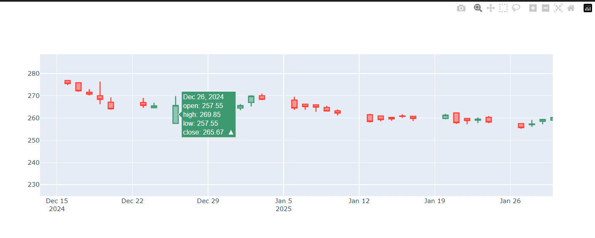
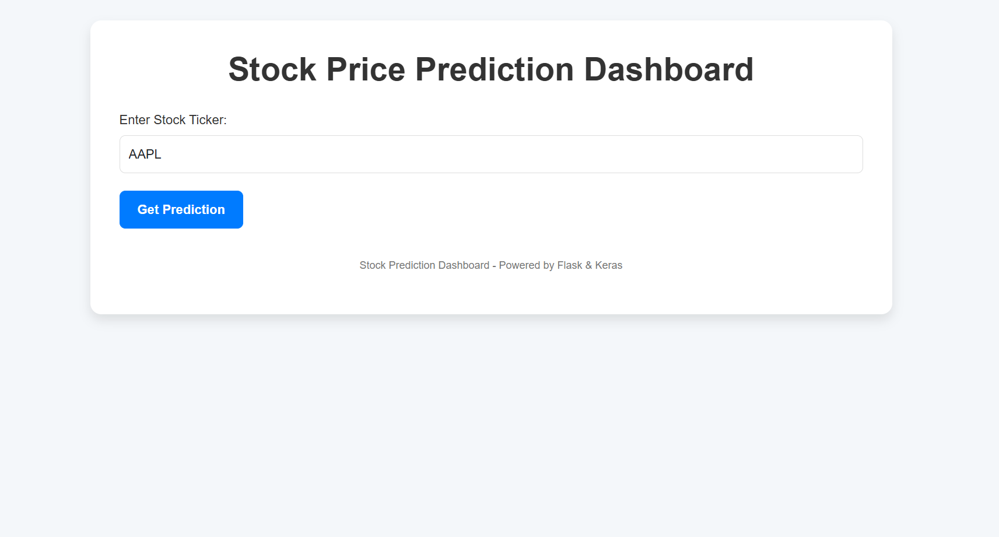
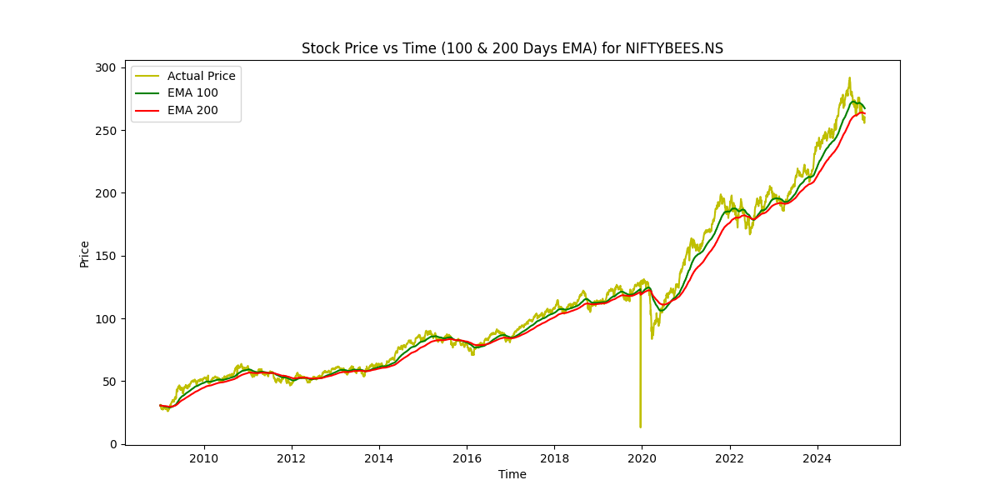
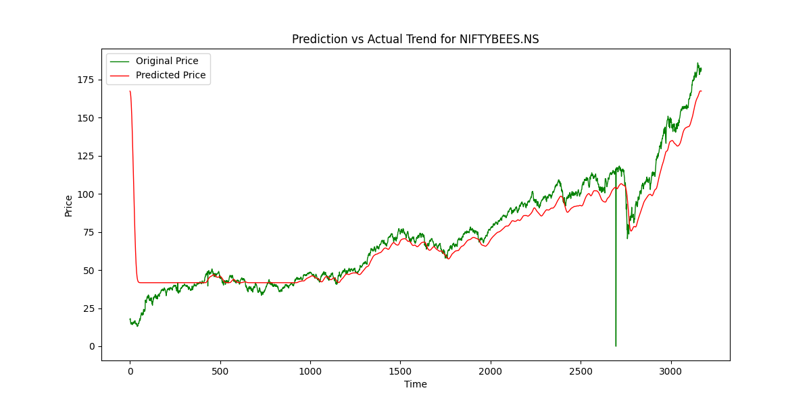

# Stock Price Prediction using LSTM & Flask
 

# Overview

This project is a Stock Price Prediction Web App that leverages LSTM (Long Short-Term Memory) networks for time-series forecasting. The application is built using Flask as the backend and allows users to input a stock ticker, visualize stock trends, and download historical stock data.

# Features

Stock Price Forecasting: Predict future stock prices based on historical trends using LSTM.

Visualization:

  * 100-day & 200-day EMA (Exponential Moving Average) displayed on a time-series graph.

  * Comparison Chart: Original vs. Predicted stock prices.

Dynamic Stock Selection: Enter any stock ticker (e.g., AAPL, NIFTYBEES) to get predictions.

Data Download: Users can download the processed dataset in CSV format.

User-Friendly UI: Built with Bootstrap for responsiveness and clean design.

# Tech Stack

Machine Learning & Data Processing

* LSTM Model (Long Short-Term Memory)

* Keras & TensorFlow (Deep Learning Framework)

* Pandas & NumPy (Data Handling & Processing)

* Scikit-Learn (MinMaxScaler for Normalization)

* Yahoo Finance API (Fetch Stock Data)

# Backend & Web Framework

Flask (Python Web Framework)

Jinja2 (Templating Engine for Flask)

# Frontend & Visualization

Bootstrap (UI Design & Responsiveness)

Matplotlib (Data Visualization)

HTML, CSS, JavaScript

# Installation & Setup

1. Clone the Repository

 git clone https://github.com/your-username/stock-prediction-flask.git
 cd stock-prediction-flask

2. Create a Virtual Environment & Install Dependencies

    python -m venv venv

    source venv/bin/activate  # For MacOS/Linux

    venv\Scripts\activate  # For Windows

    pip install -r requirements.txt

3. Run the Flask App

   python app.py

4. Access the Web Application

   Open your browser and go to: http://127.0.0.1:5000/

# How It Works

1. Data Collection: Fetch historical stock prices of NIFTYBEESV Dataset using Yahoo Finance API.

2. Data Preprocessing: Apply MinMaxScaler to normalize the stock prices.

3. Model Training:

   * Trained on 80% of historical data.

   * LSTM model predicts future stock prices.

4. Flask Backend: Handles stock ticker input and processes predictions.

5. Visualization: Displays EMA trends and predictions using Matplotlib.

# Sample Prediction Output

Frondend:
   

EMA Chart:
 

Prediction vs Original Stock Price Trend:
  
